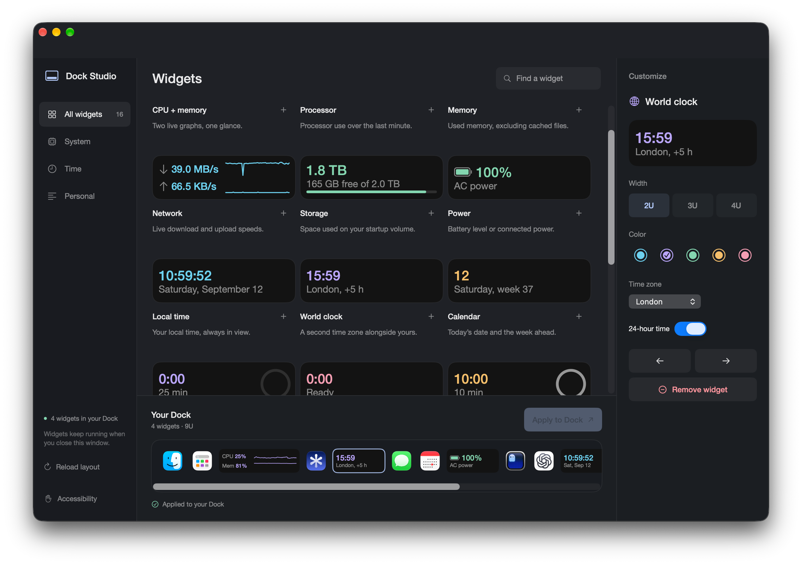

# Dock Studio

A native macOS app for arranging live widgets in your Dock. Drag widgets into the preview, customize their size and color, then apply your layout.



## What’s built

Dock Studio is an early working prototype, built with SwiftUI and AppKit.

- **A gallery of 16 local widgets** with live previews, search, and categories.
- **A drag-and-drop Dock editor** using your existing pinned app icons. Add, reorder, and remove widgets without changing the real Dock until you apply.
- **2U, 3U, and 4U widths**, five accent colors, and widget-specific settings for time zones, clock formats, timer durations, and notes. One unit is roughly one Dock icon slot.
- **Saved layouts and settings**, with separate draft and applied states, a Revert action, and a private recovery copy before applying.
- **Live widgets among your pinned apps.** Closing the editor keeps them running; the menu-bar control reopens it. Normal quit removes the widget slots it can safely identify.

### Included widgets

| Category | Widgets |
| --- | --- |
| System | CPU + memory, Processor, Memory, Network, Storage, Power, Uptime, System load, Thermal state |
| Time | Local time, World clock, Calendar, Focus timer, Stopwatch, Countdown |
| Personal | Quick note |

These work without account connections. Calendar shows the date and week, not calendar events. Thermal state is macOS’s reported pressure level, not a temperature sensor reading. CPU, memory, and network figures are lightweight samples rather than a replacement for a profiler.

## How it works

Dock Studio is **not a Dock replacement**, and these are not native WidgetKit extensions.

On **Apply to Dock**, the app inserts spacer tiles into the pinned-app layout and reloads Apple’s Dock. It then uses Accessibility to locate those slots and places small, non-activating AppKit windows over them. The same widget renderer powers the gallery and the live Dock widgets.

This gives each widget real space in the Dock while keeping Apple’s existing app icons. It works with **System Integrity Protection enabled**—no code injection or SIP changes are required.

Changing the layout requires a reload, so the Dock briefly disappears and returns. Other applications stay open. If the app cannot safely identify its slots after an outside layout change, it refuses to guess rather than remove unrelated items.

## What’s not built yet

| Area | Current limitation |
| --- | --- |
| Seamless layout animation | Native neighboring icons do not smoothly slide aside as a widget expands. Changing the allocated width still requires Apply and a Dock reload. |
| Every Dock configuration | The app currently requires a bottom-positioned Dock. Multi-monitor transitions, auto-hide, magnification, Spaces, and full-screen behavior need broader testing and refinement. |
| Connected widgets | No agent-status, Git/CI, deployment, weather, meeting-event, music-service, or Stripe integrations yet. The current catalog is local-first. |
| Distribution | No notarized release, automatic updater, Intel build target, or built-in launch-at-login option. The build script creates a locally ad-hoc-signed app. |
| Automated coverage | No automated test suite or CI pipeline yet. Layout ownership, persistence, recovery, and rendering need more coverage. |

The architecture depends on Dock preference behavior that Apple does not provide as a supported widget-extension API. macOS updates may require adjustments. Compatibility reports are especially useful.

## Build and run

You’ll need an **Apple Silicon Mac**, **macOS 14 or later**, and **Xcode 15+ or compatible command-line tools** with the macOS SDK. The build uses `xcrun swiftc` and macOS’s bundled icon tools; there are no third-party package dependencies.

The deployment target is macOS 14. Most hands-on development so far has been on macOS 27 beta; that is not a claim that every supported OS version has been tested.

```sh
git clone https://github.com/R44VC0RP/docstudio.git
cd docstudio
./build.sh
open "$HOME/Applications/Dock Studio.app"
```

The script installs to `~/Applications/Dock Studio.app`. You can pass a different output path:

```sh
./build.sh "$HOME/Desktop/Dock Studio.app"
```

### First use

1. Drag a widget from the gallery into the Dock preview, or use its **+** button.
2. Select it to set its width, color, and other options.
3. Click **Apply to Dock**. If prompted, enable Dock Studio in **System Settings → Privacy & Security → Accessibility**, then apply again.
4. Click a timer in the real Dock to start or pause it. Other widgets reopen their settings in Dock Studio.
5. Use **Quit and restore Dock** when finished. The saved draft remains available to apply on the next launch.

Settings and the recovery copy stay in `~/Library/Application Support/Dock Studio/`. That folder can contain pinned-app paths and note text; don’t upload it wholesale in a bug report.

## Help contribute

Bug reports, design feedback, compatibility testing, and focused pull requests are welcome. For a substantial change, [open an issue](https://github.com/R44VC0RP/docstudio/issues/new) first so we can agree on the approach.

### Useful places to start

- **Dock reliability:** improve slot tracking, external-layout reconciliation, safe cleanup, and recovery after interruptions. Keep SIP enabled and preserve the user’s pinned apps.
- **New widgets:** add useful local data sources or explicit, opt-in integrations. Show loading and unavailable states honestly; don’t substitute fictional live data.
- **Interaction and accessibility:** improve keyboard operation, drag-and-drop feedback, VoiceOver, contrast, and legibility at real Dock sizes.
- **Compatibility and distribution:** test different macOS versions and display arrangements, investigate Intel support, or help with signing and notarization.
- **Tests and tooling:** add coverage for layout transformations, ownership detection, settings persistence, and widget rendering, then build a lightweight CI workflow around it.

### Where the code lives

| File | Responsibility |
| --- | --- |
| [`main.swift`](main.swift) | App lifecycle, editor window, menu bar, and app icon |
| [`Sources/StudioView.swift`](Sources/StudioView.swift) | Gallery, customization inspector, and draggable Dock preview |
| [`Sources/StudioStore.swift`](Sources/StudioStore.swift) | Draft/applied layouts, persistence, Apply, and safe restoration |
| [`Sources/DockOverlays.swift`](Sources/DockOverlays.swift) | Accessibility-based positioning and live widget windows |
| [`Sources/Models.swift`](Sources/Models.swift) | Widget catalog, configuration types, and timer state |
| [`Sources/WidgetFace.swift`](Sources/WidgetFace.swift) | Shared, size-adaptive widget rendering |
| [`Sources/Telemetry.swift`](Sources/Telemetry.swift) | Local CPU, memory, network, storage, power, and system samples |
| [`build.sh`](build.sh) | Compile, bundle, generate icons, and locally sign the app |

For a new widget, start with `WidgetKind` and `WidgetInstance` in `Models.swift`, add its rendering in `WidgetFace.swift`, and add a data source or inspector controls only where needed. Check it at **2U, 3U, and 4U in the actual Dock**, not just in the larger gallery preview.

### Sending a pull request

1. Fork the repository and make a focused branch for one change.
2. Build the app and exercise the behavior you changed. For layout changes, check Apply, quit/restore, and relaunch—not only the preview.
3. Describe what changed, why, and what you verified. Include your macOS version and relevant Dock/display settings; add screenshots for visual changes when safe to publish.
4. Keep generated `.app` bundles, `.build/`, credentials, private layouts, notes, and logs out of the commit.

For bugs, include a short reproduction, expected versus actual behavior, and whether Accessibility is enabled. Reports about auto-hide, magnification, or multiple displays should include those settings too.
